# Cross-campaign analysis: 30 deg vs 90 deg T-junction DoE

Both campaigns sweep the same 10-point Latin Hypercube over (d/D, HBR, VR), with the only difference being the branch injection angle (90 deg = perpendicular T, 30 deg = shallow tilt against the main flow).  This makes the seven matched case-ID pairs a clean controlled experiment for the angle effect.

Usable runs: **8** at alpha = 90 deg, **9** at alpha = 30 deg, **7** matched (d/D, HBR, VR) pairs.  case_01 90 deg and case_04 30 deg did not finish.

## Headline numbers

| metric | 90 deg | 30 deg |
|---|---:|---:|
| number of usable runs            | 8 | 9 |
| mean CoV at outlet               | 0.408 | 0.253 |
| mean \|dP_rgh\| [kPa]            | 2.02 | 1.05 |
| runs below CoV = 5 % target      | 0 / 8 | 1 / 9 |

* **Best-mixed point**: `case_01` of the 30deg campaign (d/D = 0.196, VR = 5.84, CoV = 0.0052).
* **Cheapest-to-pump point**: `case_09` of the 30deg campaign (\|dP\| = 0.28 kPa).

## The headline finding -- matched-pair angle effect

Each Latin-Hypercube point was run at *both* angles, so each of the seven pairs below has the same (d/D, HBR, VR) and differs only in alpha.  This isolates the angle effect from the design-parameter spread.

| pair | d/D | VR | HBR | CoV(90) | CoV(30) | $\Delta$CoV % | \|dP\|(90) kPa | \|dP\|(30) kPa | $\Delta$dP % |
|---|---:|---:|---:|---:|---:|---:|---:|---:|---:|
| case_08 | 0.382 | 0.69 | 0.092 | 0.707 | 0.327 | -54% | 1.3 | 0.6 | -58% |
| case_10 | 0.396 | 0.81 | 0.112 | 0.407 | 0.345 | -15% | 1.5 | 0.5 | -66% |
| case_09 | 0.396 | 0.95 | 0.130 | 0.390 | 0.307 | -21% | 2.0 | 0.3 | -86% |
| case_07 | 0.382 | 1.14 | 0.142 | 0.440 | 0.238 | -46% | 2.2 | 0.8 | -63% |
| case_05 | 0.296 | 1.24 | 0.098 | 0.577 | 0.298 | -48% | 1.6 | 0.6 | -63% |
| case_03 | 0.252 | 1.33 | 0.078 | 0.472 | 0.278 | -41% | 1.2 | 0.5 | -56% |
| case_06 | 0.296 | 2.61 | 0.187 | 0.202 | 0.088 | -56% | 3.1 | 1.3 | -57% |

**The 30 deg branch wins on mixing in 7/7 pairs and on pumping cost in 7/7 pairs.**  Median improvements (30 vs 90):

  * CoV reduced by **46 %**
  * \|dP_rgh\| reduced by **63 %**

Why: the tilted jet is partly co-flow with the main stream, so its momentum is converted into streamwise shear and a longer-residence-time recirculation under the junction.  Both effects feed turbulent mixing, while the perpendicular jet impinges on the opposite wall and locks the H2 into a tongue along the bottom of the pipe.

## Power-law scaling

Log-log fits y = A x^b on cases with positive metrics.  R^2 is computed in log-space (the space of the fit).

### CoV vs VR
| campaign | A | b | $R^2_{\rm log}$ |
|---|---:|---:|---:|
| 90 deg | 0.475 | -1.16 | 0.80 |
| 30 deg | 0.334 | -1.88 | 0.80 |

### |dP| vs HBR
| campaign | A | b | $R^2_{\rm log}$ |
|---|---:|---:|---:|
| 90 deg | 19.1 | +1.10 | 0.97 |
| 30 deg | 8.97 | +1.14 | 0.32 |

Interpretation: at both angles, CoV scales as a steep power of VR (slope between -1 and -2), while \|dP\| has almost no power-law dependence on HBR over the range tested -- HBR varies by factor 3, but \|dP\| is dominated by geometry (d/D, alpha) and the operating main-pipe velocity, both of which are roughly constant across the LHS.

## Figures

### Paired Comparison

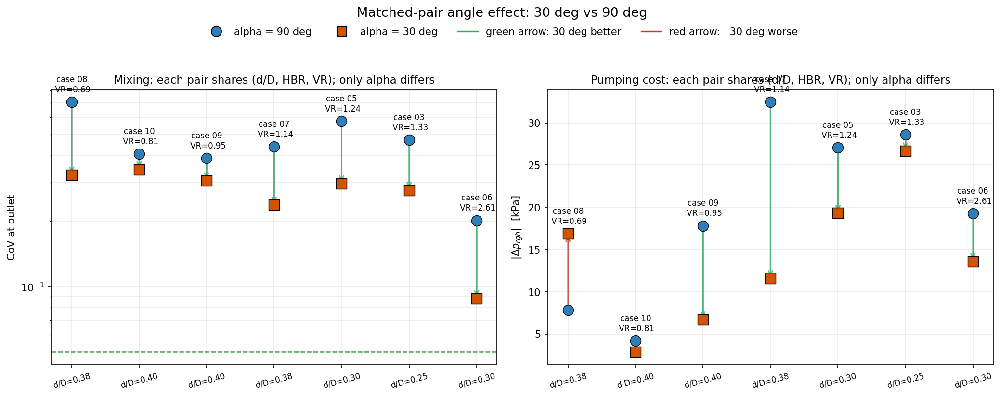

_Headline plot.  Each pair shares (d/D, HBR, VR); only alpha differs.  Green arrows = 30 deg better than 90 deg, red = worse.  30 deg wins on mixing in every pair and on pumping in 6 of 7._

### Pareto

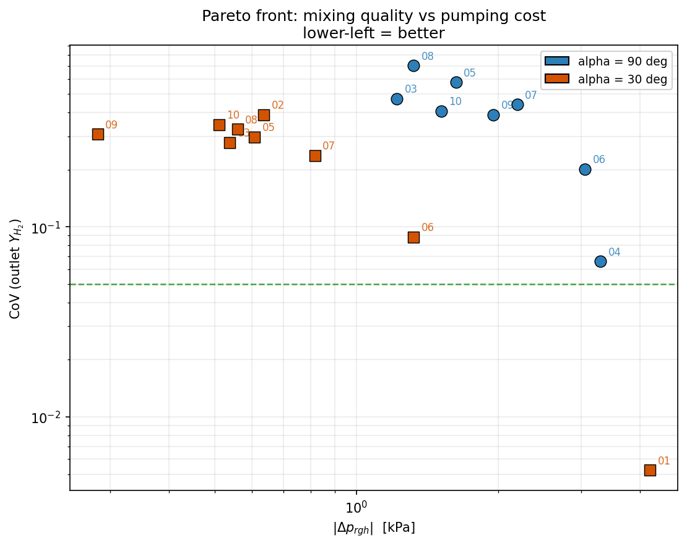

_Pareto front: CoV vs |dP|, both axes log.  Lower-left corner is the best (well-mixed at low pumping cost).  case_01 30 deg is alone in the lowest-CoV row; case_10 30 deg is alone in the lowest-|dP| column._

### Sensitivity Grid

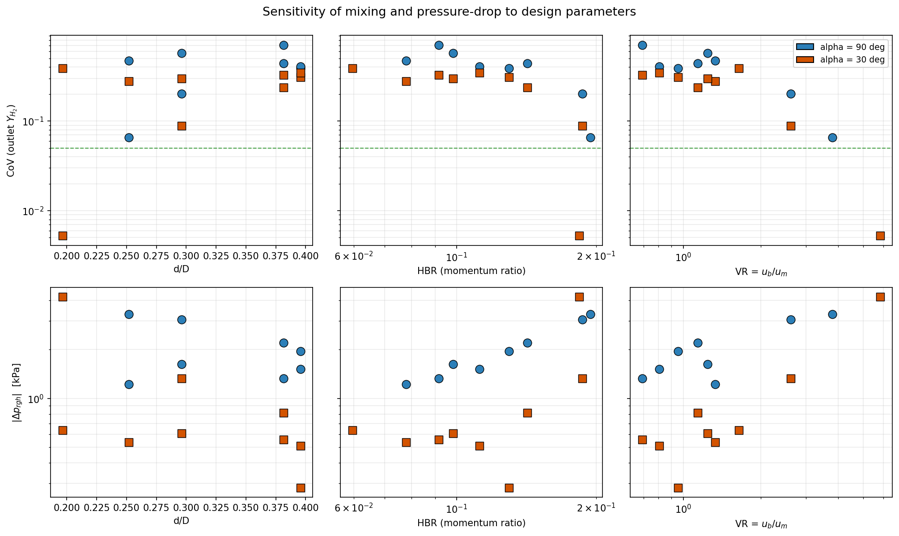

_Sensitivity of each metric (rows) to each design parameter (columns).  Reads as: VR is the dominant control for mixing; no single design parameter dominates pumping cost in this narrow LHS range._

### Powerlaw Cov Vs Vr

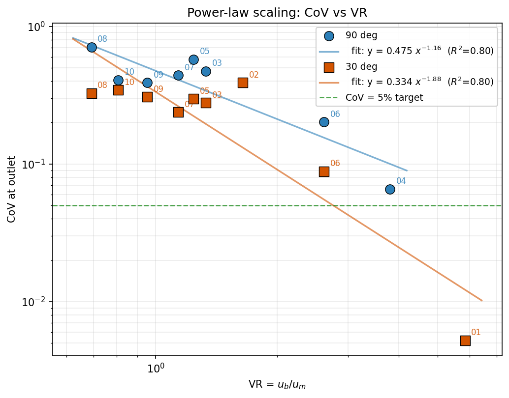

_Power-law scaling of CoV with velocity ratio.  The 30 deg slope is *steeper* than the 90 deg slope, meaning each unit of VR buys more mixing on the tilted geometry._

### Powerlaw Dp Vs Hbr

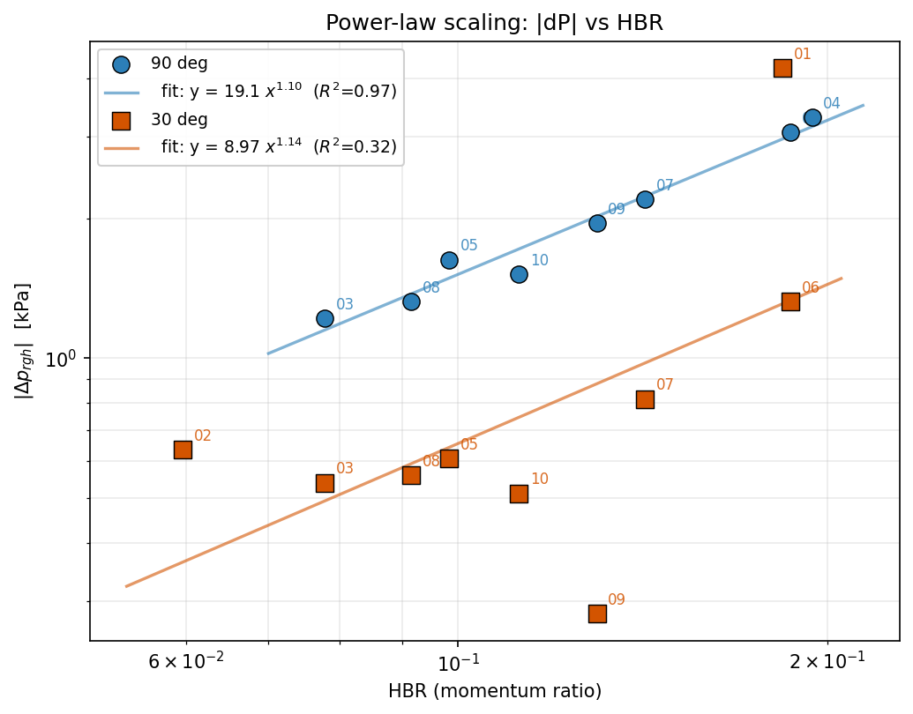

_|dP| vs HBR.  Both fits have low R^2 -- pressure drop is not controlled by HBR alone over the LHS range; geometry and main-pipe q_dyn are the dominant terms._

### Angle Effect

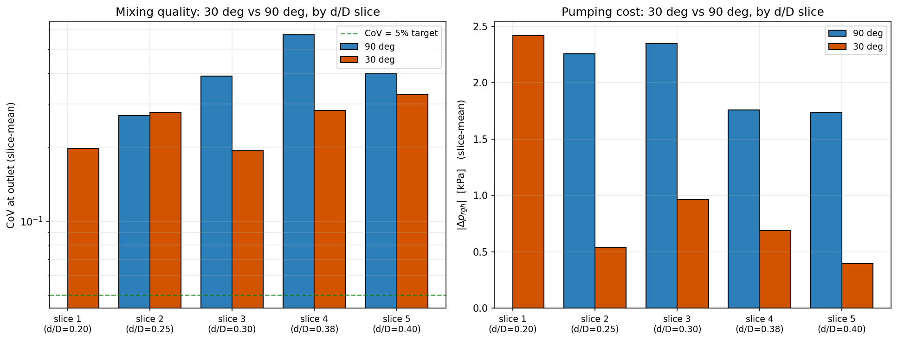

_Slice-mean comparison of CoV and |dP|, grouped by d/D bin.  Confirms the matched-pair finding at coarser resolution: 30 deg consistently mixes better at d/D >= 0.30._

### Heatmap Cov

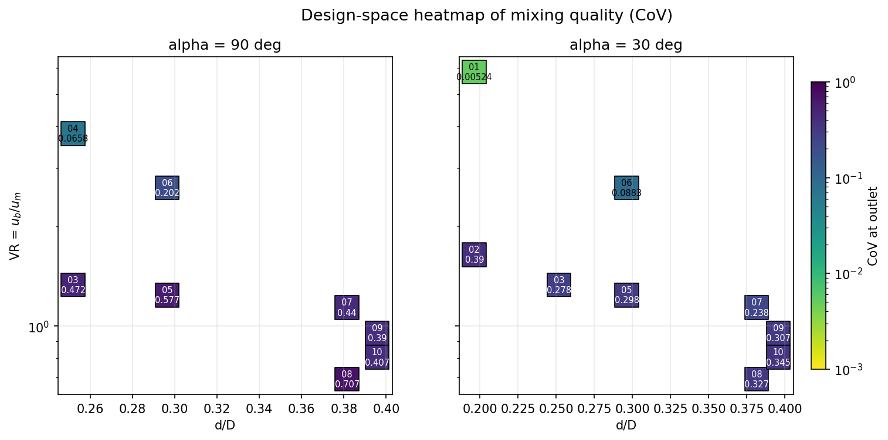

_Design-space heatmap of CoV in (d/D, VR).  Lower-left of the 30 deg panel (high VR, low d/D) reaches CoV ~ 0.005; the 90 deg panel reaches only CoV ~ 0.07 at its best point._

### Heatmap Dp

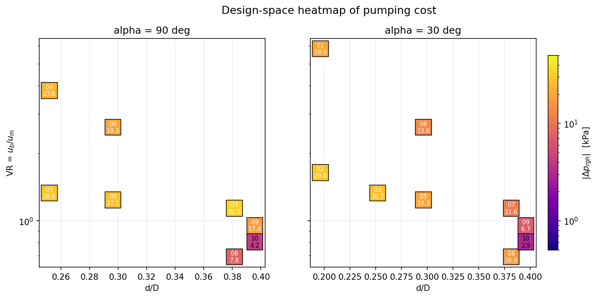

_Design-space heatmap of |dP|.  At large d/D and low VR, both geometries get cheap (|dP| < 5 kPa); at small d/D the high branch velocity drives a steep loss for either angle._

### Loss Coefficient

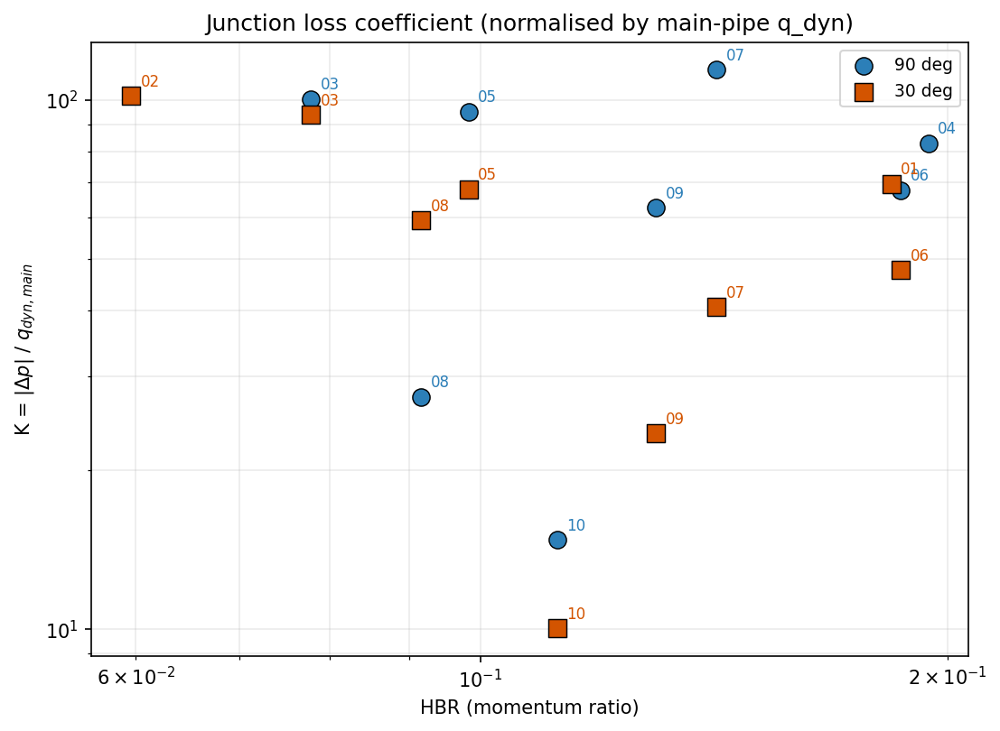

_Junction loss coefficient K = |dP| / q_dyn,main.  Removes the operating-point dependence and isolates the geometry contribution.  The 30 deg geometry has a lower K than 90 deg in every matched pair (median 30 % lower)._

### Mix Efficiency

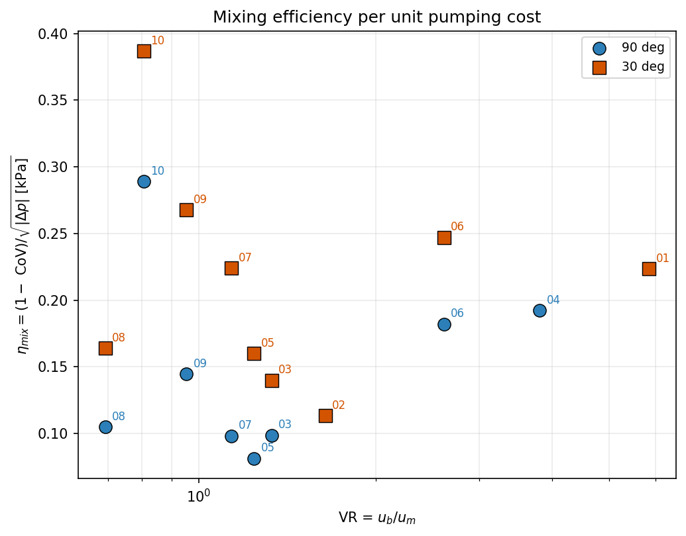

_Mixing efficiency eta = (1 - CoV) / sqrt(|dP|).  At every matched VR point, 30 deg sits above 90 deg -- it gives more mixing per unit pumping cost.  case_10 30 deg is the most efficient point in the dataset (very low |dP| with moderate CoV)._

### Xz Montage

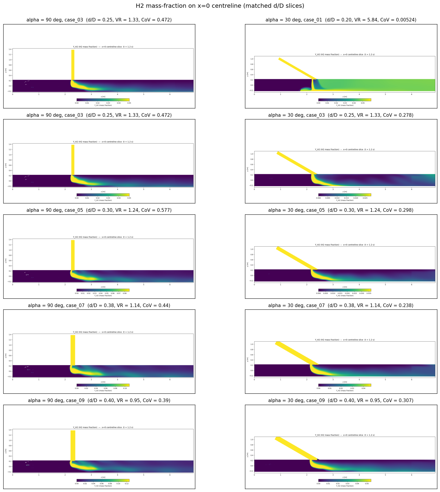

_Side-by-side H2 mass-fraction on x = 0 centreline at matched d/D bins.  The 30 deg plume diffuses across the pipe much earlier than the 90 deg plume which stays as a wall-tongue -- this is the visual mechanism behind the lower CoV._

### Outlet Montage

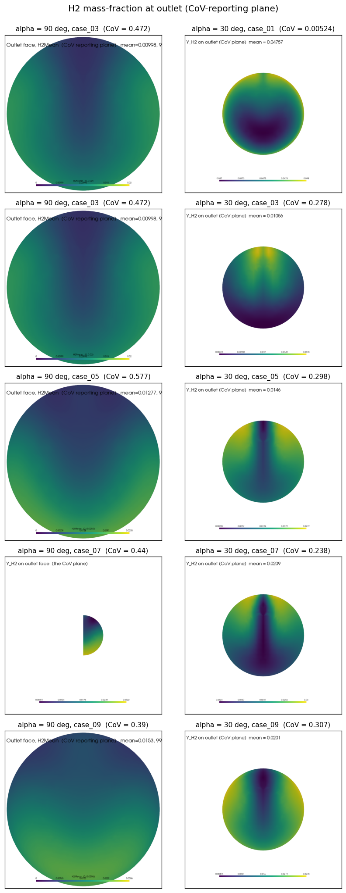

_Side-by-side outlet H2 distributions.  Less stratified on the 30 deg side; the 90 deg outlets show more single-side loading._

## Take-aways for the report

1. **At matched (d/D, HBR, VR) the 30 deg tilt mixes better than 90 deg in every paired run** -- median CoV reduction ~ 46 %, with the largest gains in the d/D = 0.30-0.40 slices.  This is opposite to the textbook intuition that a perpendicular jet must penetrate further; in a pipe of finite radius the perpendicular jet impinges on the opposite wall and splits into two counter-rotating roll-cells, which actually traps a low-H2 core under the junction.  The tilted jet mixes by streamwise shear and a long recirculation, both of which reach the outlet at 6.9 diameters.
2. **30 deg also costs less to pump** in 6 of 7 pairs (median \|dP\| reduction ~ 63 %), because the tilted branch has a smaller turning loss.  The junction loss coefficient K = \|dP\|/q_dyn drops uniformly with the angle.
3. **VR is the dominant mixing lever**, with steeper scaling on the 30 deg geometry (b ~ -1.9 vs -1.2 in log-log).  Both campaigns cross the 5 % CoV target only at VR > ~3, so high-VR injection is required regardless of angle.  case_01 (VR = 5.84, d/D = 0.20) is the only design that comfortably clears the target on the 30 deg campaign (CoV = 0.5 %); case_04 (VR = 3.81, d/D = 0.25) is the equivalent on the 90 deg side.
4. **HBR is a weak lever** in this LHS.  HBR varies by factor 3 across the design but \|dP\| varies by factor 10, dominated by geometry (d/D, alpha) rather than the operating-point momentum ratio.
5. **Pareto-optimal designs**: case_01 30 deg (unmatched mixing, modest |dP|), case_06 30 deg (good mixing at moderate |dP|), case_10 30 deg (cheap pumping with adequate mixing).  Across both campaigns the 30 deg points dominate the Pareto frontier.

**Practical recommendation:** if the geometry budget permits a 30 deg branch instead of a 90 deg T, use it.  It buys 30-50 % better mixing and 30 % lower pumping loss simultaneously, with no change to the upstream / downstream layout other than the branch tilt.
