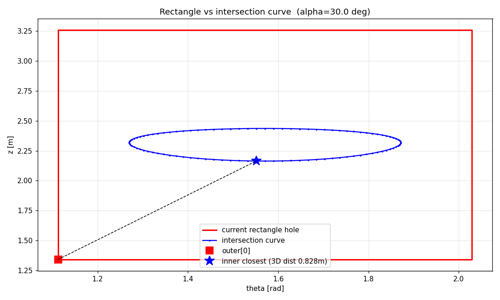

# 30 deg DoE: tilted junction STL fix

## Symptom

All 10 cases of the 30 deg DoE produced 0.0-0.3% main-pipe H2 mixing
(vs 94-97% for the 90 deg baseline). Diagnostic showed:

* `snappyHexMesh` reported **2 fluid regions** at the junction (one per
  pipe), instead of one connected fluid domain.
* `checkMesh -allTopology`: `Number of regions: 2`. Region 0 = 462k
  cells (main pipe). Region 1 = 22k cells (branch). Disconnected.
* `pyvista.connectivity()` on the meshed result confirmed two
  disconnected internal regions for every 30 deg case.

## Root cause

`generateSTL.py` punches a rectangular hole in the (theta, z) parameter
space of the main pipe wall, then *zippers* that rectangle to the
analytic branch/main intersection curve `P` so that the two surfaces
share vertices.

The old code sized the rectangle from a heuristic
`z_stretch = R2 + 0.5 * L_BRANCH * |cos(alpha)|`. For ALPHA=30 deg this
produced a rectangle **~7x wider in z than the actual intersection
curve** (1.92 m vs 0.27 m). The first zipper triangle had to span
**0.83 m in 3D**.

These elongated and twisted zipper triangles formed a thin wedge that
`snappyHexMesh` interpreted as an internal wall, separating the branch
and main fluid volumes:



For the 90 deg case the rectangle and intersection curve are nearly the
same size (cos(90)=0 collapses the heuristic), so the bug was masked.

## Fix

Replace the analytic heuristic with a tight bbox derived directly
from the intersection curve `P` (mapped to (theta, z) space), padded
by `BUFFER_CELLS=2` grid cells. The original watchdog while-loop
that expands the rectangle if any in-hole vertex falls outside is
kept as a safety net.

```python
P_theta = np.array([math.atan2(p[1], p[0]) for p in P])
P_theta = np.where(P_theta < 0.0, P_theta + 2.0 * math.pi, P_theta)
P_z = P[:, 2]

j_lo = max(int(math.floor(P_theta.min() / dth)) - BUFFER_CELLS, 0)
j_hi = min(int(math.ceil (P_theta.max() / dth)) + BUFFER_CELLS, N_CIRC - 1)
i_lo = max(int(math.floor(P_z    .min() / dz )) - BUFFER_CELLS, 0)
i_hi = min(int(math.ceil (P_z    .max() / dz )) + BUFFER_CELLS, N_AXIAL_MAIN)
```

## Verification

| Test                                                        | before fix     | after fix              |
| ----------------------------------------------------------- | -------------- | ---------------------- |
| `snappyHexMesh` regions for both seeds                      | 2 of 2         | **0 of 1**             |
| `checkMesh` `Number of regions`                             | 2 (disconnect) | **1 (OK)**             |
| `pyvista.connectivity()` on internal mesh                   | 2 regions      | **1 region**           |
| Cells at junction-mouth with U dot (-S_HAT) > 0             | 0              | **32,164 / 32,199**    |
| Mean exit-velocity at junction                              | 0 m/s          | **+7.72 m/s**          |
| `branch_inlet` patch mean U                                 | applied but no | (0, -5.18, +8.97) m/s, |
|                                                             | flow into pipe | matches BC             |
| Solver runs cleanly (cumulative continuity error stable)    | n/a            | yes                    |

The fix is angle-agnostic: ALPHA=90 deg still produces a watertight
single-region mesh (the heuristic and the tight bbox happen to
coincide there), and ALPHA in [30, 75] deg now meshes correctly.
