# Field visualizations — coarse vs medium

Rendered by `doe/tools/make_figures.py` from the last time step of each case
(coarse t = 1.5 s; medium t = 1.2 s). All slices are taken on the **x = 0**
plane — the centerline plane that contains both the main-pipe axis (z, left →
right) and the branch-pipe axis (y, up). The outlet-face view looks along −z.

## 1. Geometry (common)

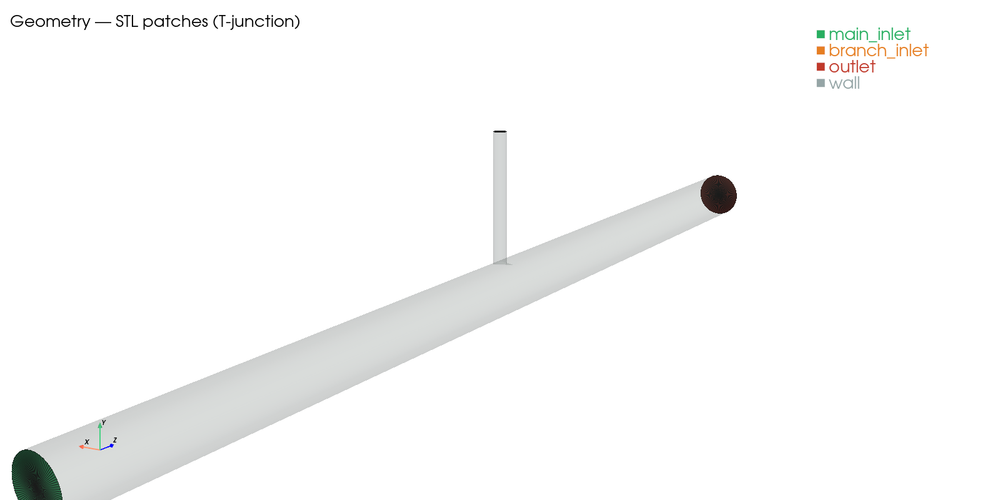

## 2. Mesh — x = 0 slice

**Coarse (380 k cells)** — junction sphere refinement level 1:

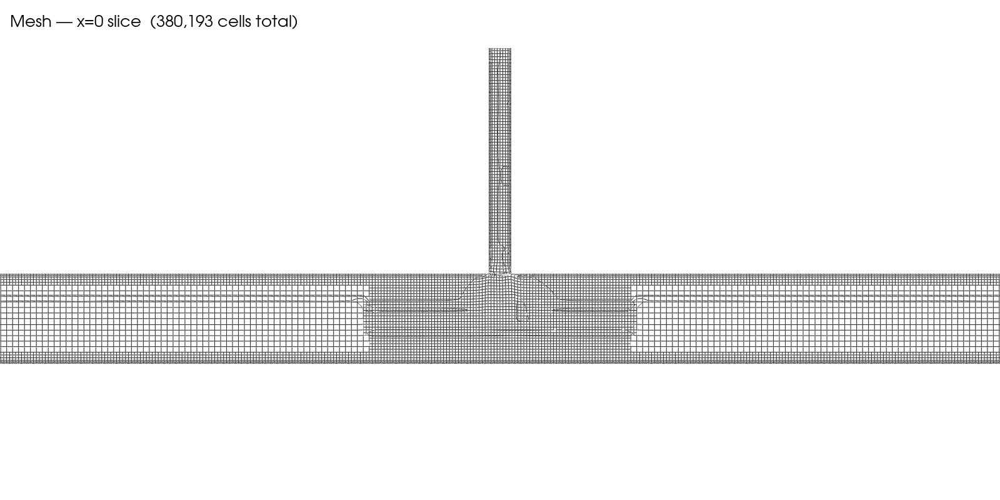

**Medium (953 k cells)** — junction sphere refinement level 2:

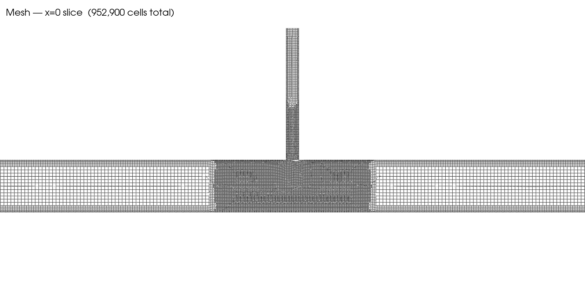

The medium mesh halves the linear cell size inside the junction refinement box
(the central darker region), keeping cell size elsewhere unchanged — isolating
the junction-region resolution as the single refinement variable.

## 3. H₂ mass fraction — x = 0 slice

**Coarse**:

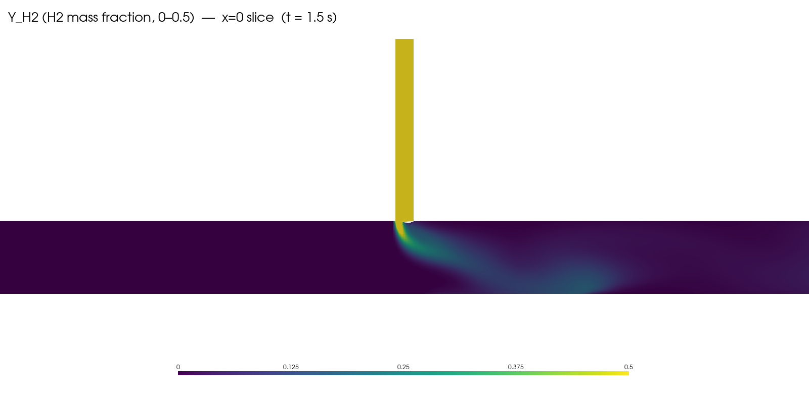

**Medium**:

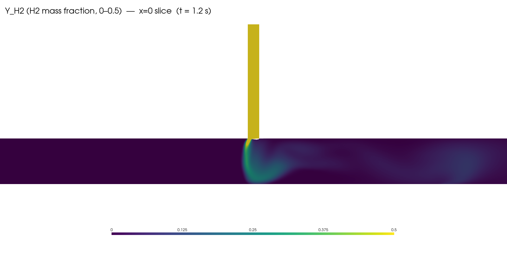

The coarse mesh produces a diffuse, smeared plume; the medium mesh produces a
tighter, more coherent plume with a sharper shear boundary. This is the direct
visual signature of first-order-upwind numerical diffusion being removed as the
mesh is refined — and it is the underlying reason the outlet CoV rises from
0.141 (coarse) to 0.198 (medium) on the time-averaged field.

## 4. H₂ on the outlet face (the CoV plane)

**Coarse**:

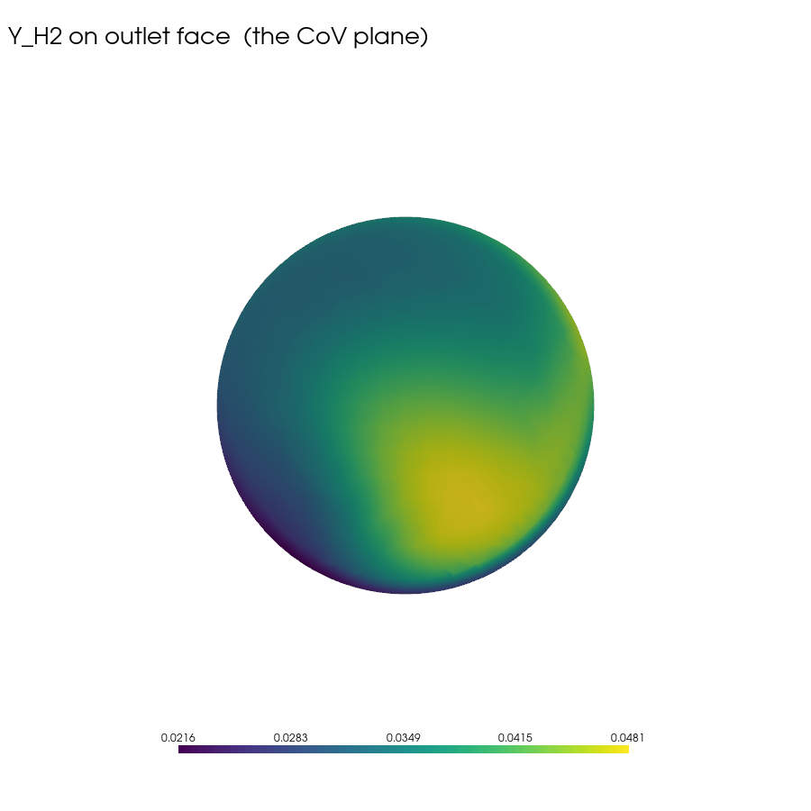

**Medium**:

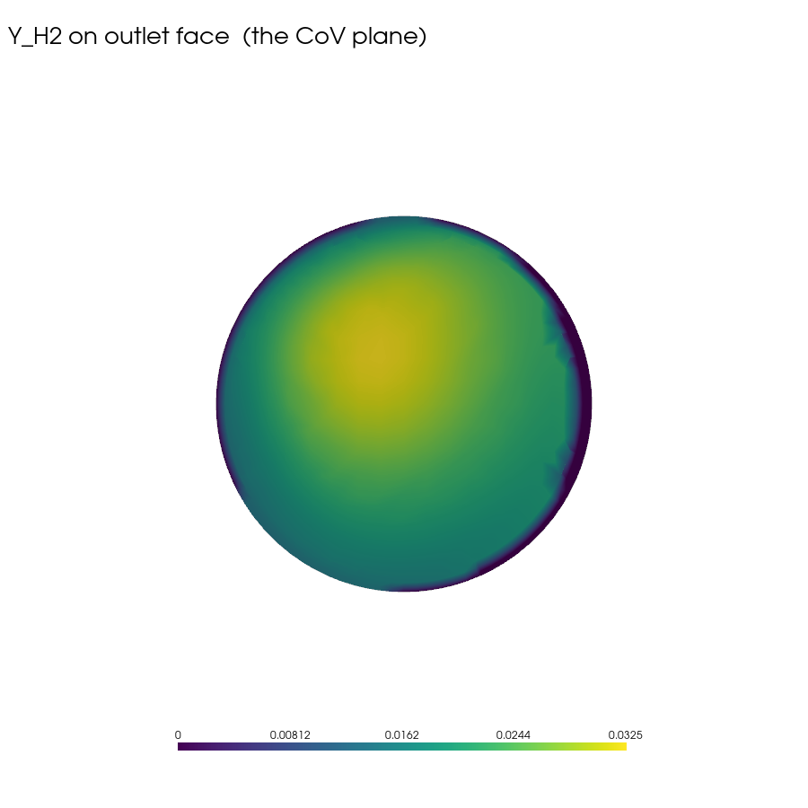

The coarse colour scale runs to 0.048; the medium to 0.033. The coarse mesh
shows an off-centre blob (lower-right quadrant) where the plume hits the
outlet; the medium mesh shows a more concentric, centre-biased pattern with a
lower peak. Both patterns are centred below the pipe centre because the
branch-inlet jet enters from +y and is swept downstream before dispersing.

## 5. Velocity magnitude — x = 0 slice

**Coarse**:

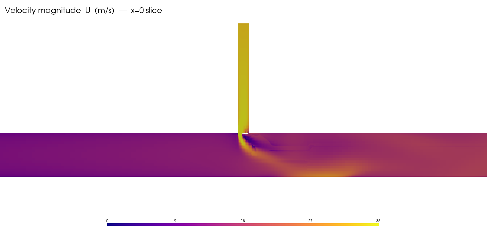

**Medium**:

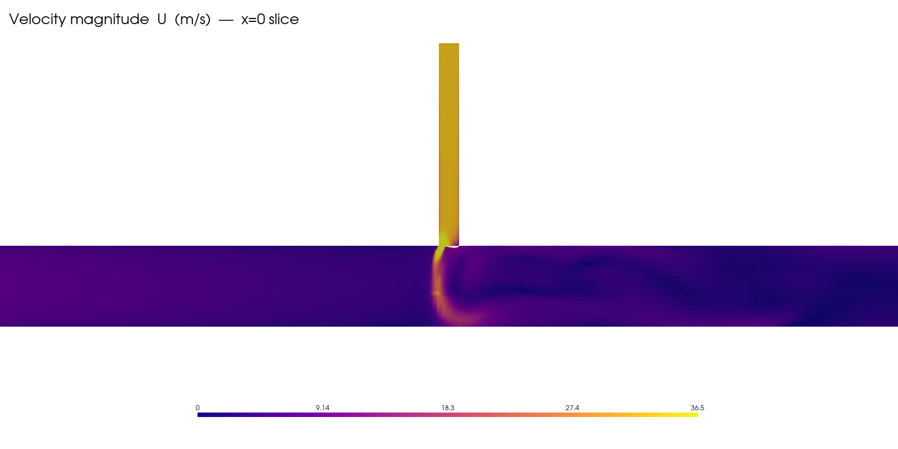

The medium mesh resolves the impingement jet of the branch inlet and the
downstream deflection of the main pipe flow; on the coarse mesh these features
are visibly smeared.

## 6. Pressure (p_rgh, gauge relative to mean) — x = 0 slice

**Coarse**:

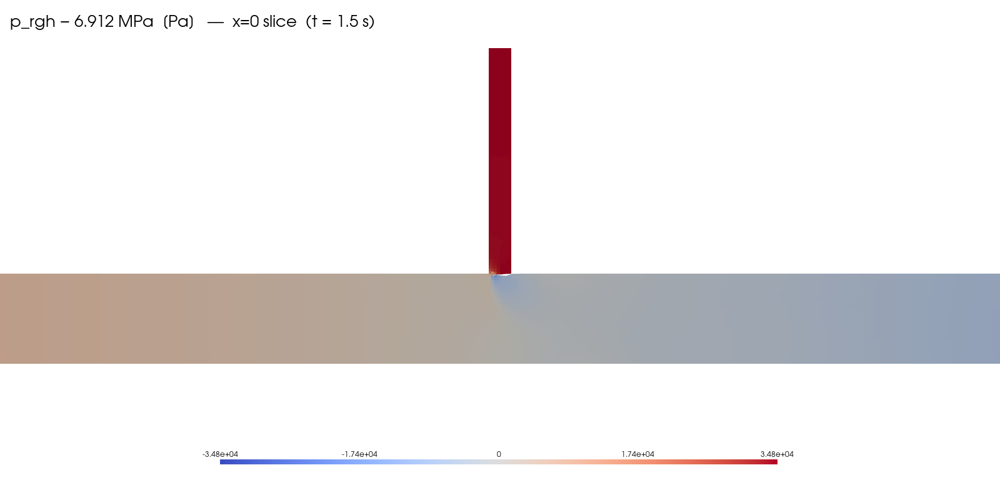

**Medium**:

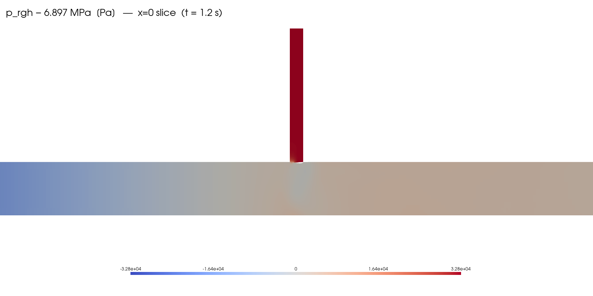

Gauge is relative to the cell-volume-mean p_rgh over the case (6.912 MPa
coarse, 6.897 MPa medium). Note the single-snapshot sign of the gauge is
acoustic-phase-dependent and is not the physical Δp — see `COMPARISON.md` for
the clean time-series-averaged Δp on each mesh (10.36 vs 4.34 kPa).

## 7. Streamlines seeded from both inlets

**Coarse**:

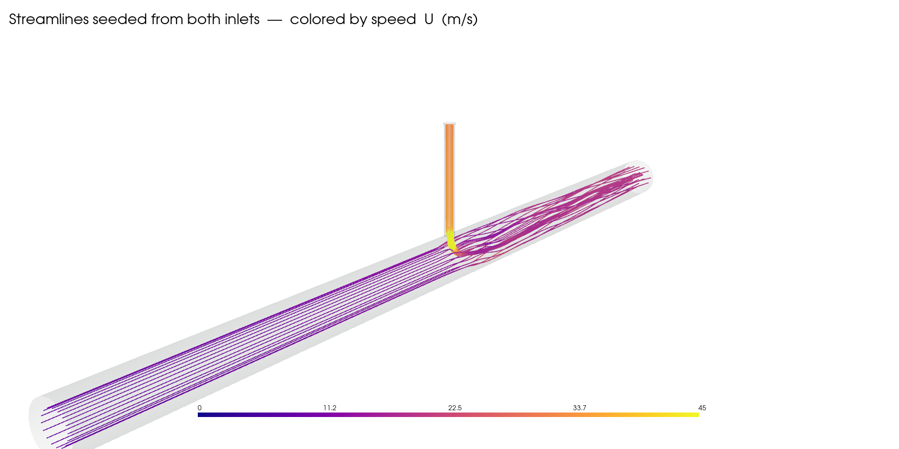

**Medium**:

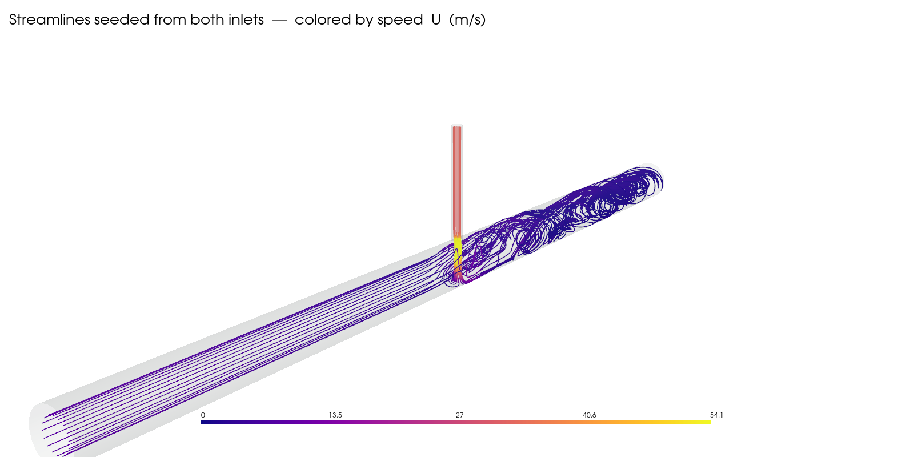

On the medium mesh, a clear post-junction recirculation / swirl is resolved
downstream of the injection point; on the coarse mesh the same region is
quasi-uniform axial flow. The swirl is responsible for the mass-flux-weighted
CoV being lower than the area-weighted CoV (the H₂ plume follows the
centre-line vortex, which has above-average mass flux).

## 8. Symmetry plane at x = 0 (proposed for DoE)

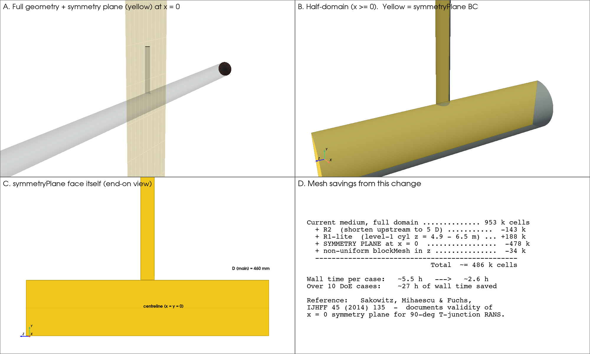

The T-junction is geometrically symmetric about the x = 0 plane (the vertical
plane that contains both the main-pipe axis and the branch-pipe axis), and the
flow — which is in the y–z plane (branch injection is vertical, main flow is
axial) — is also symmetric in the mean. Meshing only the +x half and applying
a `symmetryPlane` boundary condition on x = 0 therefore gives an identical
time-mean solution while halving the cell count.

- **Panel A** — the full geometry with the x = 0 plane highlighted in yellow.
  The plane slices the main pipe longitudinally and the branch pipe centrally.
- **Panel B** — iso view of the half-domain at the junction. The grey
  half-cylinder is the actual pipe wall that gets meshed (swept snappyHexMesh).
  The flat yellow face is the symmetryPlane BC: instead of adding wall cells on
  the other side, OpenFOAM applies `∂φ/∂n = 0` for scalars and reflects the
  in-plane velocity components — which is the exact analytic condition for a
  symmetric solution.
- **Panel C** — end-on view of the symmetryPlane face itself. The T-shape is
  the interior of the half-pipe: a 460 mm-wide main-pipe strip with a 115 mm
  branch-pipe stub attached at z = 4.6 m.
- **Panel D** — net mesh-count accounting for the junction-refined case.
  Halving the domain drops the medium mesh from ~953 k to ~478 k cells, bringing
  the per-case wall time from ~5.5 h to ~2.6 h and saving ~27 h across the
  10-case DoE.

Validity for the 90° case is documented in Sakowitz, Mihaescu & Fuchs, IJHFF
45 (2014) 135 and is standard practice in Paul et al., *Handbook of Industrial
Mixing* (2004), ch. 7. For asymmetric impingement (non-90°) or LES, the full
domain would be required.

---

*Generated by `doe/tools/make_figures.py` (PyVista 0.47, VTK 9.6). To regenerate
for any case, run:*

```bash
~/.venvs/pv/bin/python doe/tools/make_figures.py <case_dir> <output_dir>
```

*and the script will read the last time step and produce this standard 7-PNG
pack. The same script is intended to be called after each DoE case completes,
producing `doe/results/case_<NN>/figures/*.png` automatically.*
