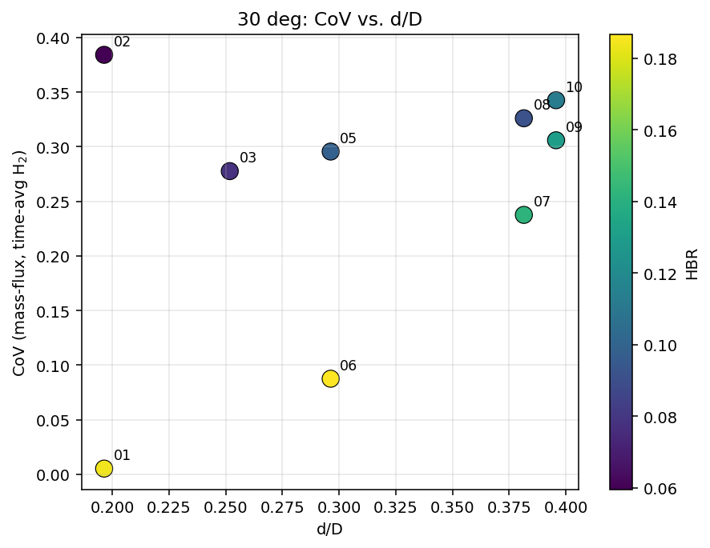
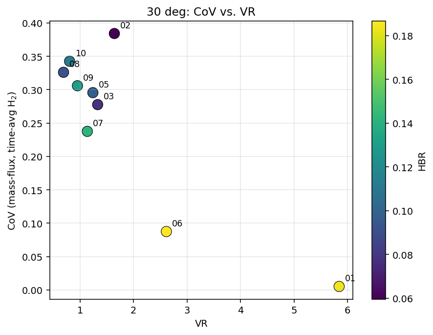
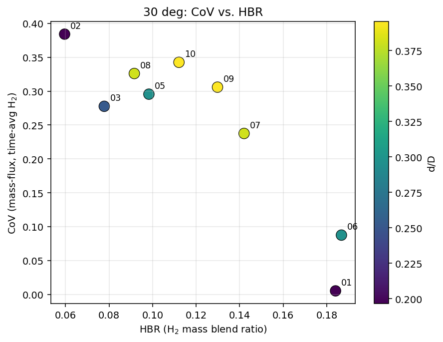
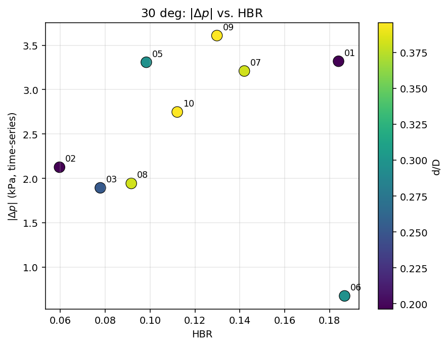
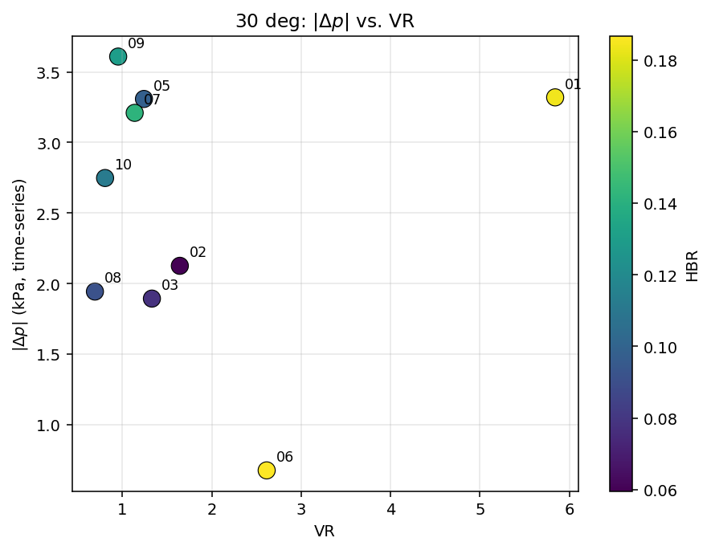
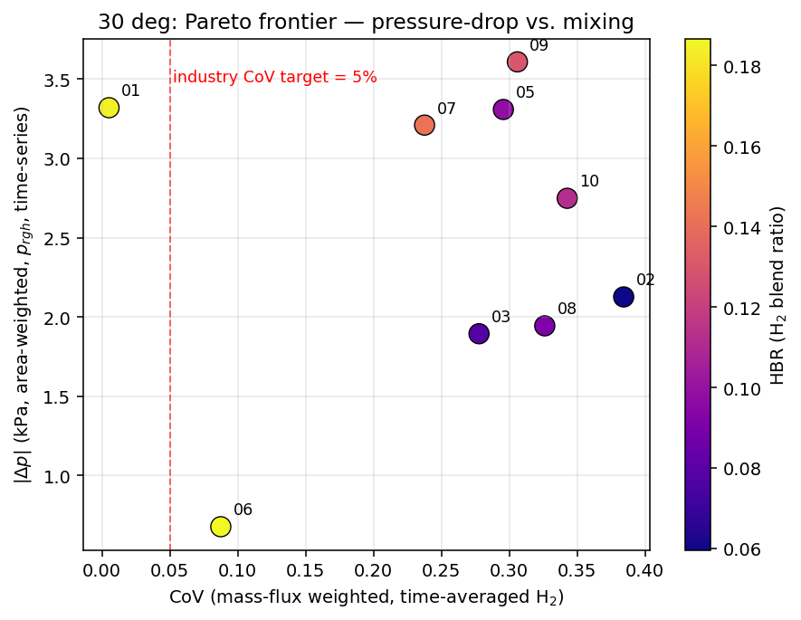
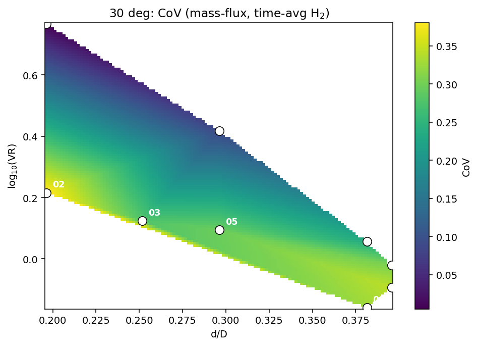
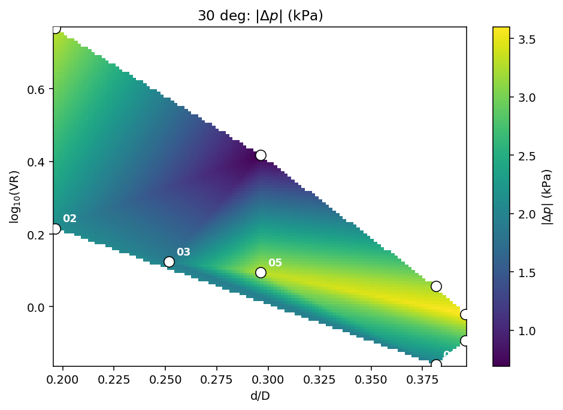

# 30 deg DoE -- figures gallery

Mixing of H$_2$ blend (HBR) into a CH$_4$ main pipe at a 30° T-junction,
solved with `rhoReactingBuoyantFoam` (variable-density transient, k--$\omega$ SST).
9 of 10 LHS-sampled cases ran to t=1.2 s (case_04 paused at t=0.215 s).

## DoE-wide summary

CoV is mass-flux weighted, computed on the time-averaged H$_2$ field
over t=0.6--1.2 s. ΔP is the area-weighted `p_rgh` time-series, every timestep.

| | |
|---|---|
|  |  |
|  |  |
|  |  |

### Heatmaps (interpolated on log-VR vs d/D)
| | |
|---|---|
|  |  |

The Pareto plot shows the design trade-off: low CoV (good mixing) tends to come
with high $|\Delta p|$ (high pumping cost). The horizontal red line at CoV = 0.05
marks the conventional industry mixing target -- only **case_01** clears it.

## Per-case figure pack

Each case has 7 figures: geometry, mesh on the symmetry plane, $Y_{H_2}$ field on
the symmetry plane and on the outlet face (the CoV plane), $|U|$ field with glyphs,
$p_{rgh}$ field, and streamlines coloured by speed.

See `../cases/case_NN/figures/` for the per-case packs.

## Best vs worst mixing -- side by side

The best mixer (case_01, d/D=0.196, VR=5.84, HBR=0.184) achieves CoV = 0.5%,
well below the 5% target.  The worst (case_02, d/D=0.196, VR=1.64, HBR=0.060)
sits at CoV = 38%.  Both share the same diameter ratio; the only difference is
that case_01 injects 5x faster, which provides the cross-stream momentum
needed to mix the jet into the bulk flow.
