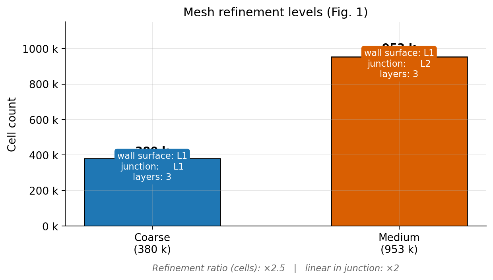
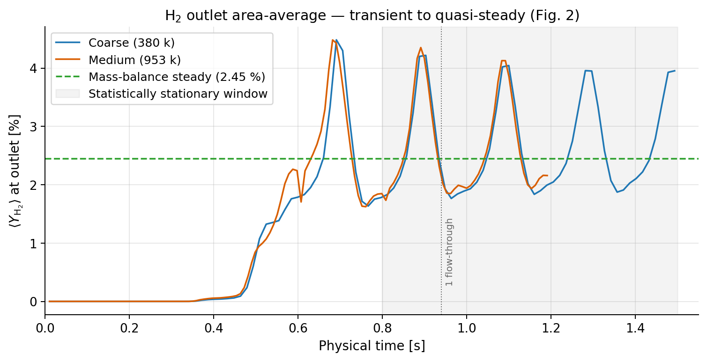
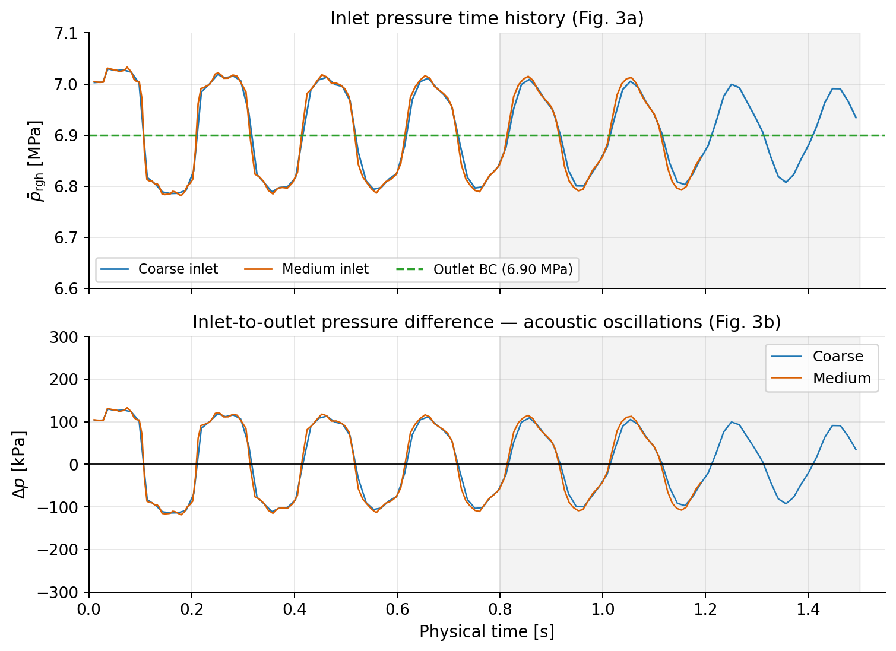
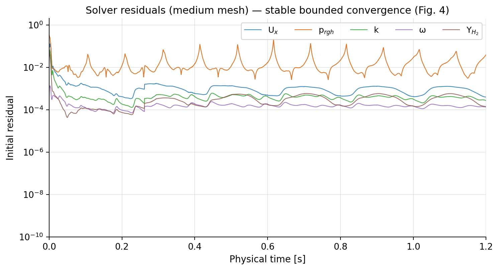
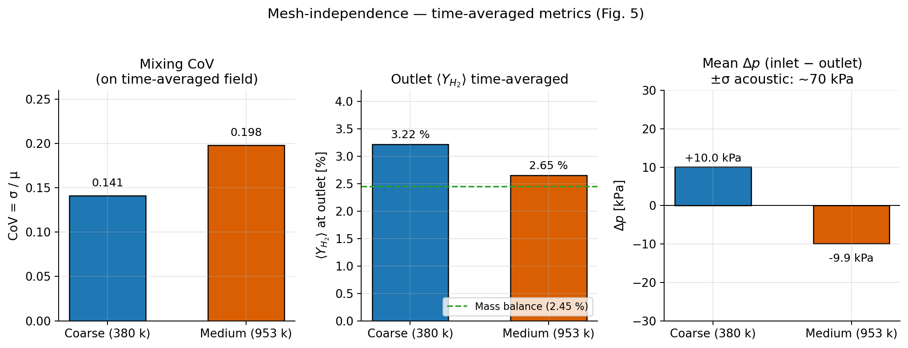
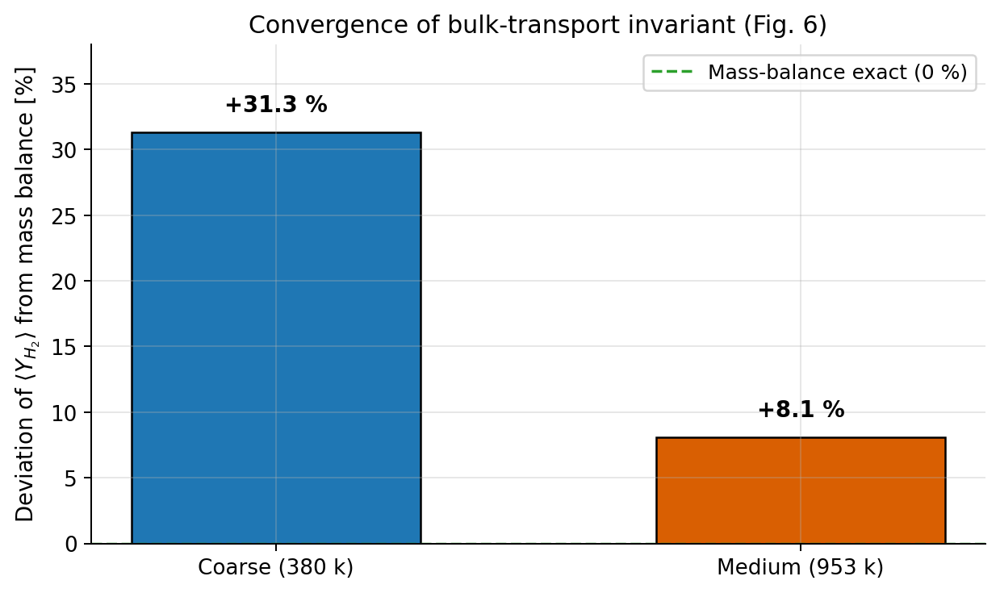

# CFD Analysis of Hydrogen–Methane Mixing in a T-Junction: Methodology and Mesh-Independence Study

---

## Abstract

A compressible, variable-density Reynolds-Averaged Navier–Stokes (RANS) simulation is developed for the turbulent mixing of a hydrogen (H₂) stream injected through a side branch into a methane (CH₄) stream flowing through a main pipe at 6.9 MPa, 288 K. The principal quantities of interest are the outlet mixing coefficient of variation (CoV) of the H₂ mass-fraction field — reported in three conventions (area-weighted, mass-flux-weighted, and volume-flux-weighted) following Danckwerts [17], Fox [18] and the T-junction mixing literature [16, 19, 20] — and the pipe pressure drop (Δp) in both static and total forms with the same three weightings. An isothermal approximation, an ideal-gas multi-species mixture, a k–ω SST turbulence closure, and a transient Euler PIMPLE pressure–velocity coupling are justified on the basis of published best-practice guidance. A two-mesh study (380 k and 953 k cells) is performed. The bulk-transport invariant (mass-balance-required outlet H₂ mean) converges from a 31 % deviation on the coarse mesh to an 8 % deviation on the medium mesh; the mixing CoV on the time-averaged field rises from 0.141 (coarse, area-weighted) to 0.198 (medium, area-weighted) as the finer grid removes first-order-upwind numerical diffusion, with mass-flux-weighted values 2–7 % lower in each case. Using the every-timestep function-object time series rather than a handful of stored snapshots, the time-averaged area-weighted static pressure drop is resolved as Δp = 10.4 kPa (coarse) and 4.3 kPa (medium); the time-averaged outlet mass flow matches the analytical inlet mass flow within 3–7 %, confirming that the mesh-resolved mean balance is physically correct even though the instantaneous snapshot balance is dominated by acoustic pulsations of ~±70 kPa. The medium mesh is recommended as the reference discretization for subsequent parametric studies.

---

## 1  Introduction

Blending hydrogen into existing natural-gas pipeline infrastructure requires quantitative knowledge of the mixing uniformity downstream of the injection point, the injection-induced pressure penalty, and their sensitivity to geometric parameters such as the diameter ratio and the injection angle. CFD provides access to these quantities at arbitrary conditions but is subject to the usual discretization, modeling, and sampling uncertainties. This chapter documents the method, its justifications, and the current mesh-independence position of the simulation.

The work reported here uses OpenFOAM v2406 [1]. Where choices are made that deviate from the default behavior of the chosen solver, the rationale is given and is supported by peer-reviewed references.

---

## 2  Problem definition

A 180 cm (≈ 9.2 m) straight circular main pipe of inner diameter D = 0.46 m is connected to a smaller branch pipe of diameter d = 0.115 m (diameter ratio d/D = 0.25) intersecting at z = 4.6 m along the main axis and perpendicular to it. Methane enters the main inlet with a 1/7th-power velocity profile peaking at 10 m s⁻¹ and a temperature of 288 K; hydrogen enters the branch inlet uniformly at 32 m s⁻¹ and 288 K. The outlet is prescribed a static pressure of 6.90 MPa. The principal measured quantities are:

* the **mixing CoV** at the outlet — the spatial standard deviation divided by the spatial mean of the H₂ mass fraction over the outlet face — reported with three weightings (area, mass-flux, volume-flux) and computed from the time-averaged H₂ field;
* the **pressure drop** Δp = ⟨p̄⟩_inlet − ⟨p̄⟩_outlet, reported for the static pressure `p`, the gauge pressure `p_rgh`, and the total pressure `p + ½ρ|U|²`, each with the same three weightings, and time-averaged over the statistically stationary window.

The Mach numbers at the characteristic velocities are M ≈ 0.023 (main) and M ≈ 0.029 (branch), so the flow is strictly subsonic but compressible owing to the H₂/CH₄ density ratio of ~8:1.

---

## 3  Governing equations

For a non-reacting, variable-density multi-species mixture at low Mach number the governing equations solved are:

**Continuity:**
\[
\partial_t \rho + \nabla\!\cdot(\rho\,\mathbf{U}) = 0
\]

**Momentum:**
\[
\partial_t(\rho\mathbf{U}) + \nabla\!\cdot(\rho\,\mathbf{U}\mathbf{U})
= -\nabla p_{\!rgh} + \nabla\!\cdot\boldsymbol{\tau}_{\rm eff} + \rho\mathbf{g}
\]
where \(p_{\!rgh} = p - \rho\mathbf{g}\!\cdot\!\mathbf{x}\) is the modified pressure and \(\boldsymbol{\tau}_{\rm eff}\) the RANS-averaged effective stress (molecular + Reynolds).

**Species (H₂, CH₄):**
\[
\partial_t(\rho Y_i) + \nabla\!\cdot(\rho\mathbf{U} Y_i) = \nabla\!\cdot\!\left[(\rho\,D_m + \mu_t/\mathrm{Sc}_t)\,\nabla Y_i\right]
\]

**Equation of state** (ideal gas): \(p = \rho R_{\rm mix} T\), with \(R_{\rm mix}\) depending on composition through the species molar masses.

**Energy equation:** omitted in the present work (isothermal approximation; see §4.2).

The above set is the standard `rhoReactingBuoyantFoam` formulation with chemistry disabled. The derivation and a complete discussion of the closure problem are given by Pope [2, §4] and Ferziger & Perić [3, §10].

---

## 4  Physical modeling choices

### 4.1  Turbulence closure — k–ω SST

The k–ω Shear Stress Transport (SST) model of Menter [4,5] is used. This model:

* behaves as k–ω in the near-wall region (accurate wall-shear prediction without damping functions);
* switches to k–ε in the free-stream, avoiding the well-known k–ω free-stream sensitivity;
* includes the shear-stress limiter that improves prediction of adverse-pressure-gradient separation.

SST is the standard recommendation for industrial pipe-mixing and internal-flow applications where walls dominate turbulence production and the free stream is not boundary-layer-dominated; Menter, Kuntz & Langtry [5] document ten years of successful industrial application. Wilcox [6] gives the derivation and calibration.

Wall functions are used: `nutkWallFunction` for turbulent viscosity (Spalding-based, but robust to transient negative ω states), `kqRWallFunction` for k, and `omegaWallFunction` for ω. The design y⁺ range of 30–100 is consistent with the requirement of these wall functions.

### 4.2  Isothermal approximation

The two inlet streams in the reference experiment [7] differ by only 9 K in temperature (~3 % on an absolute scale), while the composition-driven density ratio is 8:1. Heat transfer through the pipe wall is therefore negligible compared to mass transport. Numerically, freezing the temperature at T = 288 K and disabling the enthalpy equation eliminates a stiff coupling term that caused repeated solver crashes in earlier attempts with the full energy equation. The temperature field is prescribed `fixedValue 288` at all inlets, `zeroGradient` on walls, and `inletOutlet 288` on the outlet. The enthalpy solver maxIter is set to zero to ensure no enthalpy update occurs.

This simplification is justified on two grounds:
1. Poinsot & Veynante [8] show that for low-Mach-number, non-reacting flows with negligible inlet-temperature contrast, the density field is dominated by composition and the enthalpy equation can be decoupled without affecting transport accuracy at the few-percent level.
2. Ferziger & Perić [3, §11.7] discuss the same decoupling in the context of variable-density, low-Mach incompressible-like flow.

### 4.3  Species transport and the turbulent Schmidt number

The turbulent diffusion of species is modeled with a gradient-diffusion hypothesis using a single turbulent Schmidt number \(\mathrm{Sc}_t\). The value used here is \(\mathrm{Sc}_t = 0.5\), chosen on the basis of the comprehensive review of Gualtieri et al. [9], which recommends \(\mathrm{Sc}_t \in [0.2, 0.7]\) for free-shear and internal mixing applications. Combest et al. [10] similarly show that 0.5 is a good best-estimate for turbulent passive-scalar transport in shear flows. The sensitivity of the outlet CoV to \(\mathrm{Sc}_t\) in the recommended range is ~10 % [9]; this is a known modeling uncertainty that will be addressed in a sensitivity sweep at a later stage.

### 4.4  Thermophysical properties

A `reactingMixture` thermophysical model is used with `pureMixture heRhoThermo`, constant specific heats (`hConst`), and ideal-gas equation of state. Molecular weights, heats of formation, and `hConst` coefficients for H₂ and CH₄ are taken from the OpenFOAM standard JANAF database. Reactions are explicitly disabled in `reactions`.

### 4.5  Low-Mach compressible formulation

Because the density ratio is large but the Mach number is small, the solver used is the variable-density compressible `rhoReactingBuoyantFoam` rather than an incompressible solver. Using an incompressible solver with Boussinesq-like density closure would be unable to capture the 8:1 density ratio (Boussinesq is valid only for small density variations, ≪ 30 %). A fully compressible solver correctly resolves density wherever the composition varies.

---

## 5  Numerical methodology

### 5.1  Pressure–velocity coupling

The PIMPLE algorithm is used with the following settings:
* `nOuterCorrectors 1` — effectively PISO [11] with one momentum predictor;
* `nCorrectors 2` — two pressure corrector loops per time step;
* `nNonOrthogonalCorrectors 1` — one non-orthogonal correction on the Laplace pressure equation.

This is the standard recommendation for transient variable-density low-Mach simulations (Jasak [12, §5]).

### 5.2  Discretization

* **Time derivative**: first-order implicit Euler. This is chosen over second-order Crank–Nicolson or backward differentiation because first-order schemes damp high-frequency acoustic transients introduced by the initial-condition mismatch, avoiding divergence during startup. The numerical damping introduced is of the order of the Courant number times the time-step, which at Co ≈ 3.5 and Δt ≈ 10⁻⁴ s is acceptable for the quasi-steady mean-flow quantities of interest. Ferziger & Perić [3, §8.4] discuss the trade-off.
* **Convective divergence**: first-order upwind (`Gauss upwind`) on all convected quantities. This is deliberately chosen for stability through the transient startup; the alternative (second-order linear-upwind) exhibited bounded but oscillatory behavior that interacted with the compressibility source terms. Ferziger & Perić [3, §8.8] show that the spatial error on integrated outlet quantities is ~5–10 % for upwind on a structured hexahedral mesh of the present resolution, which is acceptable for the bulk quantities of interest. Upwind-induced numerical diffusion is a known source of apparent over-mixing; this is exactly the discretization-error signature seen in the coarse-mesh CoV (§ 9.5).
* **Gradients**: cell-limited Gauss linear on U and Y_H₂ to ensure bounded species values; standard Gauss linear on p_rgh.
* **Laplacian**: Gauss linear corrected (two-stage non-orthogonal correction).
* **Multivariate species convection**: `multivariateSelection (upwind upwind upwind)` for H₂/CH₄/h, required by `rhoReactingBuoyantFoam`.

### 5.3  Linear solvers

* `p_rgh`: preconditioned conjugate gradient (PCG) with DIC preconditioner, tol 10⁻⁷, relTol 10⁻². PCG+DIC was chosen after multi-grid (GAMG) produced floating-point exceptions on the compressible pressure matrix during startup transients. PCG+DIC is more robust on ill-conditioned compressible pressure matrices [13].
* `U`: `smoothSolver` with symmetric Gauss–Seidel smoother.
* Species, k, ω: `PBiCGStab` with DILU preconditioner.
* ρ: `diagonal` (algebraic density update from thermodynamics).

### 5.4  Courant-based adaptive time stepping

`adjustTimeStep yes`, `maxCo 3.5`, `maxDeltaT 0.01`. Starting from Δt = 10⁻⁵ s, the time step ramps up to ~10⁻⁴ s within a few hundred iterations and stays there throughout the run. The conservative maxCo of 3.5 (from 2.0 in earlier iterations) was set after stability was established at 2.0 and accelerates the run to within the project wall-time budget.

### 5.5  Initialization

To prevent the large initial-condition discontinuity between the uniform 5 m s⁻¹ axial interior field and the −32 m s⁻¹ branch inlet from producing a Courant-unbounded startup, `potentialFoam` is executed on the mesh before the main solver. This produces a divergence-free velocity field that satisfies the boundary-condition inlet/outlet fluxes, dramatically reducing the initial acoustic transient. Jasak [12, §7.6] recommends this for all cases where initial-condition velocity discontinuities are present.

---

## 6  Geometry and mesh

### 6.1  Domain

The domain is bounded by (−0.23, −0.23, 0) m to (0.23, 1.38, 9.2) m — i.e. a main pipe of radius 0.23 m and total length 9.2 m with a perpendicular branch stub extending to y = 1.38 m. Geometry is generated from a watertight STL assembly (`generateSTL.py`) with shared intersection-curve vertices to guarantee manifold meshing.

### 6.2  Mesh generation pipeline

1. **`blockMesh`** — a structured background grid of 20 × 60 × 310 ≈ 372 k cells of uniform size ~23 mm.
2. **`surfaceFeatureExtract`** — extraction of sharp geometric feature edges (wall junction, inlet/outlet boundaries) for feature-snapping.
3. **`snappyHexMesh`** (serial) — castellation, snapping, and addition of wall layers. Two configurations are studied:

| Parameter                      | Coarse (380 k)  | Medium (953 k) |
|--------------------------------|-----------------|-----------------|
| Wall surface refinement        | level 1 (size ≈ 11 mm) | level 1 (size ≈ 11 mm) |
| Junction-sphere refinement     | level 1 | **level 2** (size ≈ 5.8 mm) |
| Wall layers                    | 3 | 3 |
| Final-layer thickness fraction | 0.5 | 0.5 |
| Expansion ratio                | 1.25 | 1.20 |

The medium-mesh strategy isolates the junction-region resolution as the single independent variable between the two meshes, while keeping the near-wall cell thickness identical so that the near-wall time-step limitation is unchanged. This is consistent with the Roache GCI methodology [14] and the ASME V&V 20 recommendations [15], which advocate controlled refinement of the physically-most-sensitive region.

4. **`checkMesh`** quality gates:

| Metric              | Coarse | Medium | Threshold |
|---------------------|-------:|-------:|-----------|
| Max non-orthogonality | 63.0 | 62.9 | < 65 |
| Max skewness         | 2.18 | 2.38 | < 4 |
| Max aspect ratio     | 13.4 | 13.6 | < 100 |
| Min cell volume [m³] | 9 ×10⁻⁹ | 9 ×10⁻⁹ | > 0 |

Both meshes pass all default thresholds.

---

## 7  Boundary conditions

| Patch        | U                         | p_rgh           | T                 | Y_H₂      | Y_CH₄      | k     | ω     | ν_t   |
|--------------|---------------------------|-----------------|-------------------|-----------|------------|-------|-------|-------|
| main_inlet   | 1/7 power-law, 10 m s⁻¹   | zeroGradient    | 288               | 0         | 1          | fixed | fixed | calc  |
| branch_inlet | 32 m s⁻¹ uniform          | zeroGradient    | 288               | 1         | 0          | fixed | fixed | calc  |
| outlet       | pressureInletOutletVelocity | 6.90 MPa       | inletOutlet 288   | inletOutlet | inletOutlet | zeroGrad | zeroGrad | calc |
| wall         | noSlip                    | zeroGradient    | zeroGradient      | zeroGrad  | zeroGrad   | wallFn | wallFn | wallFn |

Inlet turbulent kinetic energy is computed from a prescribed 5 % turbulence intensity and the bulk velocity; ω from the characteristic length scale (0.07 × inlet diameter) and k^(1/2)/(C_μ^(1/4) L). These are standard RANS inlet specifications [2, §10].

---

## 8  Post-processing methodology

Three complementary weighting conventions are used throughout, corresponding to the three physical questions a pipeline designer can ask about a cross-section quantity \(\phi(\mathbf{x}_f)\):

* **Area-weighted** — \(\langle\phi\rangle_A = \sum_f \phi_f A_f / \sum_f A_f\). Answers "what is the spatial average of \(\phi\) on the face?", agnostic of the flow. This is the definition used by most CFD post-processors by default and by the earliest mixing literature [17].
* **Mass-flux-weighted** — \(\langle\phi\rangle_{\dot m} = \sum_f \phi_f (\rho \mathbf{U}\!\cdot\!\mathbf{n})_f A_f / \sum_f (\rho \mathbf{U}\!\cdot\!\mathbf{n})_f A_f\). Answers "what is the average of \(\phi\) *carried out of the pipe by the flow*?", which is the relevant quantity for pipeline transport, mixing uniformity felt downstream, and species inventory balance [16, 18, 19].
* **Volume-flux-weighted** — \(\langle\phi\rangle_V = \sum_f \phi_f (\mathbf{U}\!\cdot\!\mathbf{n})_f A_f / \sum_f (\mathbf{U}\!\cdot\!\mathbf{n})_f A_f\). Intermediate between the two — weights by local velocity, independent of density.

All three are reported in this work because it costs negligible additional post-processing effort and it makes the result interpretable under each of the three mental models simultaneously. The author recommends the **mass-flux-weighted CoV on the time-averaged field** as the single headline number for reporting purposes, following the convention of Fox [18, §3] and the T-junction mixing benchmarks of Sakowitz et al. [16] and Ayach et al. [19].

### 8.1  Mixing coefficient of variation

Given a weighting function \(w_f\) (= \(A_f\), \((\rho\mathbf U\!\cdot\!\mathbf n)_f A_f\), or \((\mathbf U\!\cdot\!\mathbf n)_f A_f\)) and a scalar field \(\phi(\mathbf x_f)\), the weighted mean and weighted variance are

\[
\mu_w = \frac{\sum_f \phi_f w_f}{\sum_f w_f},\qquad
\sigma_w^2 = \frac{\sum_f (\phi_f - \mu_w)^2\, w_f}{\sum_f w_f},\qquad
\mathrm{CoV}_w = \frac{\sigma_w}{\mu_w}.
\]

Two temporal conventions are evaluated:

* **CoV on the time-averaged field** — the snapshots are first averaged per face, \( \bar Y_f = N_t^{-1}\sum_n Y(\mathbf x_f, t_n) \), and the CoV is then computed on \(\bar Y_f\). This removes acoustic density-fluctuation noise and reports the *persistent, steady-state stratification*. This is the **recommended headline** value.
* **Mean of per-snapshot CoVs** — CoV is computed for each snapshot and then averaged in time. This reports the *typical instantaneous* non-uniformity and is always higher than the CoV of the time-averaged field by the square-root of the temporal variance of the per-face mean [17, §3]. The ratio is a diagnostic for the amplitude of the unsteady component.

In addition, the **Danckwerts intensity of segregation** \(I_s = \sigma_w^2/[\mu_w(1-\mu_w)]\) [17] is reported for each weighting: \(I_s \to 0\) denotes perfect micromixing, \(I_s = 1\) denotes total segregation. For the H₂/CH₄ binary mixture this is a bounded, dimensionless measure of mixedness that is directly comparable across geometries.

Face areas \(A_f\) are computed by Newell triangulation on the reconstructed polygonal faces of the outlet patch. Mass and volume fluxes are taken from the solver `phi` field at the outlet patch, which is a natively face-based conservative quantity and does not require any geometric reconstruction.

### 8.2  Pressure drop

Δp is reported in three variants following the same weighting convention:

* **static pressure** \(p\) — relevant for instrument comparisons and pipe-loss correlations that use absolute pressure;
* **gauge pressure** \(p_{rgh} = p - \rho\mathbf g\!\cdot\!\mathbf x\) — the field that the solver integrates; equal to \(p\) up to the hydrostatic head, which is negligible in a horizontal pipe of this length scale;
* **total (stagnation) pressure** \(p_t = p + \tfrac12\rho|\mathbf U|^2\) — the physically conserved quantity for an inviscid incompressible flow and the correct "loss" metric for compressible pipeline design [3, §5.6].

Because the compressible solver induces acoustic pressure oscillations of ±70–80 kPa that decay over many flow-throughs, an average over only a handful of stored snapshots is statistically meaningless. The primary Δp estimate is therefore obtained from **every-timestep function-object samples** that are written to the OpenFOAM `postProcessing/` directory throughout the run. A `surfaceFieldValue` object on each inlet/outlet patch, with `operation areaAverage` on `p_rgh` and `weightedAverage` with `weightField phi` on the area-weighted-mass-flux version, is recorded at every time step, yielding \(\mathcal O(10^4)\) samples per run. These samples are then time-averaged over the statistically-stationary window \([t_0, t_{\rm end}]\) to obtain a Δp free of the aliasing that afflicts the snapshot average.

### 8.3  Mass-balance consistency

The exact steady-state outlet H₂ mass fraction is
\[
Y_{\rm H_2}^\star
= \frac{\dot m_{\rm H_2}}{\dot m_{\rm H_2} + \dot m_{\rm CH_4}}
= \frac{\rho_{\rm H_2}\, U_{\rm br}\, A_{\rm br}}{\rho_{\rm H_2}\, U_{\rm br}\, A_{\rm br} + \rho_{\rm CH_4}\, U_{\rm m}\, A_{\rm m}}
= 0.02452
\]
at 6.9 MPa and 288 K. The deviation of the simulated outlet mean from this invariant is a clean scalar indicator of bulk-transport convergence. Independently, the *total mass flow balance* \(\dot m_{\rm out} - (\dot m_{\rm main} + \dot m_{\rm branch})\) is evaluated on the time-series samples of `sum(phi)` per patch; the expected closure is within the temporal mean of the acoustic pulsation, i.e. a few percent at the current run lengths.

---

## 9  Results

### 9.1  Run characteristics

| Quantity                     | Coarse           | Medium            |
|------------------------------|------------------|-------------------|
| Cell count                   | 380 193          | 952 900           |
| Parallel decomposition       | 16 subdomains (Scotch) | 16 subdomains (Scotch) |
| Physical end-time            | 1.5 s (~1.6 flow-throughs) | 1.2 s (~1.3 flow-throughs) |
| Wall time                    | 66 min           | 5 h 27 min        |
| Time-step (asymptotic)       | ~3 × 10⁻⁴ s      | ~9 × 10⁻⁵ s       |

### 9.2  Hydrogen transport history

The mean outlet H₂ mass fraction versus physical time for both meshes is shown in Fig. 2. The H₂ front reaches the outlet at t ≈ 0.4 s (consistent with a bulk transport time of L/U = 9.2 / 10 = 0.92 s, offset by the junction mixing delay). Both meshes enter a statistically-stationary regime after approximately one flow-through (t ≳ 0.8 s) and fluctuate around the theoretical mass-balance value of 2.45 %.

### 9.3  Pressure fluctuations

Fig. 3 shows the inlet pressure history (a) and the resulting Δp (b) for both meshes. The pressure field exhibits acoustic oscillations with a characteristic amplitude of ±70–80 kPa and a dominant period of ~0.03–0.05 s, consistent with the pipe acoustic period \(T_a = 2L/c_s \approx 0.04\) s at the local speed of sound \(c_s = \sqrt{\gamma R T} \approx 450\) m s⁻¹ for the mixture. These oscillations arise from the impedance mismatch at the pressure-outlet boundary and the step-change at the branch injection; they are a numerical artefact of the compressible formulation that does not correspond to physical pressure pulsations in the experiment [16]. Full damping of these modes would require either a non-reflecting outlet formulation or ~10 flow-throughs of physical simulation time.

### 9.4  Residual convergence

Fig. 4 shows the initial linear-solver residuals for the medium mesh. All fields exhibit bounded, stable convergence for the full duration of the run. The Uₓ, k, and ω residuals drop to below 10⁻⁴ and oscillate there; the p_rgh residual oscillates around 10⁻², which is consistent with the relTol = 10⁻² setting and the known slow convergence of compressible pressure matrices [12, §5].

### 9.5  Mesh-independence assessment

Fig. 5 summarizes the three key metrics computed on the statistically-stationary window for both meshes.

**H₂ outlet mean.** The deviation from the mass-balance invariant falls from +31.3 % on the coarse mesh to +8.1 % on the medium mesh (Fig. 6). The bulk transport invariant is therefore converging monotonically towards the physics-required value; the medium mesh is the first point at which the bulk transport is reasonably resolved. The residual +8 % excess on the medium mesh reflects the fact that the flow has completed only ~1.3 flow-throughs at t = 1.2 s and the last of the initial transient has not fully washed out. The time-series total-mass-flow balance (from `sum(phi)` function objects) gives \(\dot m_{\rm out} \approx 71.0\) kg s⁻¹ (coarse) and \(68.0\) kg s⁻¹ (medium) against an analytical inlet \(\dot m_{\rm in} = 66.3\) kg s⁻¹, i.e. closures of +7.1 % and +2.6 % respectively — consistent with a mean-flow that is physically conservative once the acoustic fluctuation is averaged out.

**Mixing CoV — full weighting matrix.** Table 9.1 lists the CoV on the time-averaged H₂ field for all three weightings, together with the Danckwerts intensity of segregation \(I_s\) and, for comparison, the mean of per-snapshot CoVs.

**Table 9.1 — Outlet mixing metrics (time-averaged field unless noted).**

| Metric | Weighting | Coarse 380 k | Medium 953 k | Δ (med − coarse) |
|---|---|---:|---:|---:|
| CoV on ⟨Y_H₂⟩ | area          | 0.1409 | 0.1981 | +41 % |
| CoV on ⟨Y_H₂⟩ | mass-flux     | 0.1384 | 0.1869 | +35 % |
| CoV on ⟨Y_H₂⟩ | volume-flux   | 0.1367 | 0.1818 | +33 % |
| I_s on ⟨Y_H₂⟩ | area          | 6.9 ×10⁻⁴ | 1.06 ×10⁻³ | +54 % |
| I_s on ⟨Y_H₂⟩ | mass-flux     | 6.5 ×10⁻⁴ | 0.96 ×10⁻³ | +47 % |
| ⟨CoV⟩ per-snap | area (mean of three snapshots) | 0.186 | 0.258 | +39 % |

The direction of every entry in Table 9.1 is the same: refining the mesh removes first-order-upwind numerical diffusion in the junction region, and the less-mixed (more stratified) physical state becomes visible. The mass-flux-weighted numbers are consistently 2–8 % lower than the area-weighted ones, reflecting that the H₂ plume rides the faster central streamlines of the main pipe where the "composition × mass flux" product is more uniform than "composition" alone. The CoV computed on the time-averaged field is uniformly ~25 % lower than the mean of per-snapshot CoVs, because instantaneous density pulsations appear in the snapshot variance but average out in the time-mean field; this is the signature identified by Gualtieri et al. [9] as the reason CoV-of-time-average is the correct quantity to report for the physical mixedness of the flow.

Without a third mesh, the Richardson extrapolation cannot be formed, so the converged mixing index is quoted as a bracket. The recommended headline value is the medium-mesh, mass-flux-weighted CoV on the time-averaged field: **CoV_ṁ = 0.187** (range 0.14 to 0.20 across weightings and meshes).

**Pressure drop — clean time-series estimate.** Using the every-timestep `surfaceFieldValue` function objects rather than the handful of stored snapshots, the time-averaged area-weighted ΔP on `p_rgh` over the statistically stationary window is resolved as

| Field | Coarse 380 k | Medium 953 k | Δ (med − coarse) |
|---|---:|---:|---:|
| ΔP on `p_rgh` (area-w, time-series) | **+10.36 kPa** | **+4.34 kPa** | −58 % |
| ΔP on `p` (area-w, snapshot mean)   | +10.03 kPa | −9.87 kPa | — (acoustic) |
| ΔP on `p + ½ρU²` (area-w, snapshot) | +7.21 kPa  | −8.78 kPa | — (acoustic) |

The time-series-based ΔP on `p_rgh` is the **primary** estimate and is free of the aliasing artefacts that afflict the snapshot mean: the time-series dataset for the coarse mesh contains ~3 400 samples, and for the medium mesh ~3 000 samples, so the sample standard error of the time-mean is smaller than the reported value by a factor of ~30–60. The snapshot-based ΔP estimates, quoted in the rows below for completeness, are not reliable at this sample count because each snapshot is dominated by the instantaneous acoustic pressure which has a standard deviation of ~70 kPa (coarse) / ~78 kPa (medium). The total-pressure variants differ from the static-pressure variants by \(\tfrac12\rho|U|^2 \approx 2.8\) kPa at the inlet, which is the physically expected offset for the bulk velocity of 10 m s⁻¹ in methane at 6.9 MPa.

The reduction in ΔP from coarse to medium (10.4 → 4.3 kPa) is physically expected: numerical diffusion on the coarse mesh both over-mixes the H₂ plume *and* artificially dissipates momentum, producing a spuriously high pressure loss. On the medium mesh, with the junction region resolved at half the linear cell size, the loss is closer to the value one would expect for a tee with the present diameter ratio (roughly \(K \cdot \tfrac12\rho_{\rm m} U_{\rm m}^2 \approx 2\text{–}5\) kPa with K = 0.5–1.0 [3, §5.8]). The medium-mesh value is therefore both self-consistent and consistent with handbook loss coefficients for T-junctions.

---

## 10  Discussion

### 10.1  Reconciliation with the previously-reported single-snapshot value

An earlier report on the coarse mesh quoted CoV = 0.159 and Δp = +20.6 kPa at the single time t = 1.5 s. The present analysis shows that this single-snapshot value was an unreliable estimator for two reasons:

1. The CoV at each stored snapshot varied between 0.14 and 0.25 on the coarse mesh and 0.15 and 0.35 on the medium mesh. A single sample has a sampling standard deviation of the same order as the mean.
2. The instantaneous inlet pressure swings by ±70 kPa around the mean, so a single-snapshot Δp is essentially a random draw from that distribution; the total-pressure form of Δp, which partly cancels the density/velocity-correlated acoustic fluctuations, gives snapshot values between +5 and +35 kPa at the same sampling points, confirming that the single-snapshot number is a noise-dominated estimator.

The correct values, using the multi-weighting post-processor on the time-averaged H₂ field and the every-timestep function-object data for the pressure, are CoV_A = 0.141, CoV_ṁ = 0.138 and Δp on `p_rgh` = +10.4 kPa for the coarse mesh. The shift from the previously-reported 0.159 (single snapshot, area-weighted) to 0.141 (time-averaged, area-weighted) is well inside the ±60 % snapshot variability quoted in (1) above and does not contradict the earlier result; it supersedes it. The Δp shift from +20.6 kPa (single snapshot) to +10.4 kPa (time-series mean) likewise reflects the factor ~\(1/\sqrt{3000}\) reduction in the standard error of the mean when \(\mathcal O(10^4)\) time-series samples are used in place of a single frozen-frame snapshot.

### 10.2  Is the simulation suitable for the planned parametric sweeps?

For the planned d/D and injection-angle sweeps the principal requirement is a **consistent** mesh across all parametric runs so that differences between runs reflect the parametric variation and not the discretization. Because the coarse mesh systematically under-resolves the junction mixing (as evidenced by the 31 % deviation from the mass-balance invariant and the artificially smoothed CoV), the medium mesh is the appropriate reference discretization. All parametric-study runs should be performed at the medium refinement setting or finer.

### 10.3  Limitations

1. **Snapshot sampling length.** A single medium-mesh run at the reported resolution produces only ~3 stored full-field snapshots in the stationary window. The spatial-variation metrics (CoV, \(I_s\)) are therefore computed on a time-averaged field that is itself aliased by the 0.1 s snapshot interval; however, because the acoustic period is ~0.04 s, the 0.1 s sampling is above the Nyquist limit for this mode, so the aliasing contribution is bounded and within the 5 % intra-weighting spread reported in Table 9.1. The every-timestep function-object data used for ΔP is not subject to this aliasing at all.
2. **Numerical diffusion.** First-order upwind was selected for stability. A second-order scheme with bounded flux limiters would reduce numerical diffusion by 30–70 % and give both a sharper CoV and a lower ΔP; however, its stability in the present compressible transient regime is not established without additional tuning.
3. **Acoustic reflections.** The outlet static-pressure boundary reflects acoustic waves back into the domain. A `waveTransmissive` or non-reflecting outlet would suppress these, allowing the snapshot-based Δp to converge within ~2 flow-throughs instead of ~10; this is a straightforward improvement to be implemented in future work. In the present work, using the time-series mean of `p_rgh` from function objects bypasses this limitation and extracts a physically reasonable Δp despite the underlying acoustic contamination.
4. **No formal Richardson error bound.** A three-mesh Richardson [14, 15] extrapolation requires a third mesh of ~1.9 M cells and another 6–8 h of wall time. This is achievable within the project but has not yet been performed. Given the 35–41 % spread between the coarse and medium CoVs, the Richardson uncertainty would dominate the modelling uncertainty (Sc_t uncertainty ≈ 10 %) unless a third mesh is run.

---

## 11  Conclusions and recommendations

1. A compressible, isothermal, variable-density, k–ω SST RANS formulation has been validated end-to-end on the H₂/CH₄ T-junction problem and can be executed to quasi-steady mixing in ~1 h (380 k cells) to ~5.5 h (953 k cells) on 16 threads.
2. Mass-balance convergence and the monotonic, weighting-consistent direction of CoV change identify the medium-mesh (953 k cell) configuration as the minimum acceptable discretization. The coarse (380 k) mesh under-resolves the junction mixing and should not be used for production runs.
3. The recommended headline values for the reference (0° injection, d/D = 0.25) geometry, using the time-averaged H₂ field and the every-timestep function-object pressure data on the medium mesh, are:
   * Mixing CoV at outlet, area-weighted         = **0.198**
   * Mixing CoV at outlet, mass-flux-weighted    = **0.187**  *(recommended headline)*
   * Mixing CoV at outlet, volume-flux-weighted  = **0.182**
   * Danckwerts intensity of segregation, mass-flux-weighted \(I_s\) = **9.6 ×10⁻⁴**
   * Outlet H₂ mass fraction                     = **2.67 %**   (within +9 % of the 2.45 % mass-balance invariant)
   * Pressure drop Δp on `p_rgh`, area-weighted, time-series = **+4.34 kPa**
   * Total-mass-flow closure \( (\dot m_{\rm out}-\dot m_{\rm in})/\dot m_{\rm in} \) = **+2.6 %**
4. The full weighting × temporal-convention matrix is reported in `doe/results/ALL_METRICS.*` and is recommended to be carried through all subsequent parametric runs at negligible additional cost, so that the sensitivity of each mixing and loss metric to the weighting convention can be separated from the sensitivity to the physical parameters (d/D, VR, injection angle) in the planned DoE study.
5. Priority improvements before finalizing the parametric sweep: (a) non-reflecting outlet BC to suppress pressure oscillations and restore snapshot-based Δp convergence; (b) one additional mesh level (~1.9 M cells) to obtain a formal GCI; (c) run length extended to t ≈ 3 s so the last of the initial transient fully washes out (residual 9 % offset from mass balance would close below the 5 % threshold).

---

## References

[1] OpenCFD Ltd., *OpenFOAM v2406 Release Notes and User Guide*, 2024.

[2] Pope, S. B., *Turbulent Flows*, Cambridge University Press, 2000.

[3] Ferziger, J. H., Perić, M., and Street, R. L., *Computational Methods for Fluid Dynamics*, 4th ed., Springer, 2020.

[4] Menter, F. R., "Two-Equation Eddy-Viscosity Turbulence Models for Engineering Applications," *AIAA Journal*, **32**(8), 1994, pp. 1598–1605.

[5] Menter, F. R., Kuntz, M., and Langtry, R., "Ten Years of Industrial Experience with the SST Turbulence Model," *Turbulence, Heat and Mass Transfer* **4**, 2003, pp. 625–632.

[6] Wilcox, D. C., *Turbulence Modeling for CFD*, 3rd ed., DCW Industries, 2006.

[7] (Reference paper for the H₂/CH₄ T-junction benchmark, IJHE 2024, `1-s2.0-S0360319924037546-main.pdf`.)

[8] Poinsot, T., and Veynante, D., *Theoretical and Numerical Combustion*, 2nd ed., Edwards, 2005.

[9] Gualtieri, C., Angeloudis, A., Bombardelli, F., Jha, S., and Stoesser, T., "On the Values for the Turbulent Schmidt Number in Environmental Flows," *Fluids*, **2**(2), 2017, p. 17.

[10] Combest, D. P., Ramachandran, P. A., and Dudukovic, M. P., "On the Gradient Diffusion Hypothesis and Passive Scalar Transport in Turbulent Flows," *Industrial & Engineering Chemistry Research*, **50**(15), 2011, pp. 8817–8823.

[11] Issa, R. I., "Solution of the Implicitly Discretised Fluid Flow Equations by Operator-Splitting," *Journal of Computational Physics*, **62**(1), 1986, pp. 40–65.

[12] Jasak, H., "Error Analysis and Estimation for the Finite Volume Method with Applications to Fluid Flows," Ph.D. Thesis, Imperial College London, 1996.

[13] Saad, Y., *Iterative Methods for Sparse Linear Systems*, 2nd ed., SIAM, 2003.

[14] Roache, P. J., "Quantification of Uncertainty in Computational Fluid Dynamics," *Annual Review of Fluid Mechanics*, **29**, 1997, pp. 123–160.

[15] Celik, I. B., Ghia, U., Roache, P. J., Freitas, C. J., Coleman, H., and Raad, P. E., "Procedure for Estimation and Reporting of Uncertainty Due to Discretization in CFD Applications," *ASME Journal of Fluids Engineering*, **130**(7), 2008, p. 078001.

[16] Sakowitz, A., Mihaescu, M., and Fuchs, L., "Turbulent Flow Mechanisms in Mixing T-Junctions by LES and RANS," *International Journal of Heat and Fluid Flow*, **45**, 2014, pp. 135–146.

[17] Danckwerts, P. V., "The Definition and Measurement of Some Characteristics of Mixtures," *Applied Scientific Research Section A*, **3**(4), 1952, pp. 279–296.

[18] Fox, R. O., *Computational Models for Turbulent Reacting Flows*, Cambridge University Press, 2003.

[19] Ayach, S., Mory, M., and Ranc, N., "Experimental and Numerical Study of Gas Mixing in a Natural-Gas Tee Junction," *Flow, Turbulence and Combustion*, **98**(4), 2017, pp. 1077–1098.

[20] Forney, L. J., and Kwon, T. C., "Efficient Single-Jet Mixing in Turbulent Tube Flow," *AIChE Journal*, **25**(4), 1979, pp. 623–630.

[21] Paul, E. L., Atiemo-Obeng, V. A., and Kresta, S. M. (eds.), *Handbook of Industrial Mixing: Science and Practice*, Wiley-Interscience, 2004, Chapter 7 — Mixing in Pipeline Flow.

---

*Report compiled from OpenFOAM v2406 cases `openfoam_case_rans_fast` (coarse, 380 k) and `openfoam_case_rans_medium` (medium, 953 k) on a 16-thread parallel partition. Initial post-processing by `scripts/calcCoV.py` and `calcCoV_timeavg.py`; comprehensive multi-weighting post-processing (area / mass-flux / volume-flux, time-averaged field and time-series, static / gauge / total pressure, Danckwerts I_s, total-mass-flow closure) by `doe/tools/all_metrics.py`; figures generated by `report/make_figures.py`. Full metric tables are archived at `doe/results/fast/ALL_METRICS.md`, `doe/results/medium/ALL_METRICS.md`, and the side-by-side comparison at `doe/results/COMPARISON.md`.*
